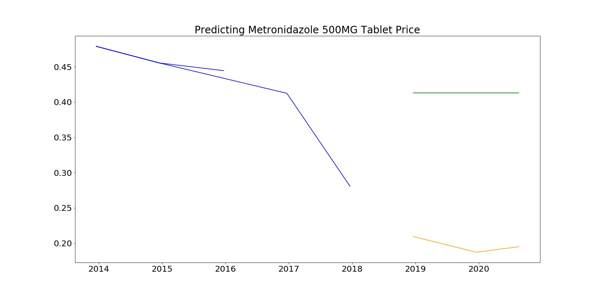

# Predicting Drug Prices
Dana Hackel, General Assembly DSI Capstone Project
## Problem Statement
The price of many drugs, both prescription (Rx) and over the counter (OTC) can often be very expensive.
Having a way to predict price can help pharmaceutical companies determine price for newly approve drugs and can help companies compare their current
price to similar drugs to determine if they are priced competitively. I will use the National Average Drug Acquisition cost data to build a regression model
that predicts drug price values and I will also create an interactive visual to explore factors related to drug price.

## Data Collection
My data was downloaded from the following sources:

[National Average Drug Acquisition Cost](https://healthdata.gov/dataset/nadac-national-average-drug-acquisition-cost)

        The National Average Drug Acquisition Cost information is collected from Medicaid.
[FDA Orange Book Data](https://www.fda.gov/drugs/drug-approvals-and-databases/orange-book-data-files)

        The Orange Book is a list of all drug products approved by the FDA.

## Data Cleaning and Exploration
Originally, I planned to work with just the NADAC data, however I quickly realized that the dataset did not provide the names of drugs, just their active ingredient.
I first tried to match their national drug code (NDC) numbers to a NDC database from the FDA. The NDC database would have provided
drug name and some other features such as phamacological type (i.e. analgesic/ pain reliever, antihistamine, selective serotonin reuptake inhibitor (SSRI), etc) however
some of the NDC's in the NADAC dataset were missing part of the code. So, I planned to use a library called Fuzzywuzzy to match the NDCs in the two datasets.
The Fuzzywuzzy library uses Levenshtein distance to determine strings which are similar based on a score (in my case, 85% similarity). While trying to match NDC numbers, I quickly learned that
this would not work as planned. If one number was slightly out of order, it would match drugs with slightly different NDCs that were not similar at all (i.e. an antacid was matched
with hand-sanitizer). After more research, I realized this was because Levenshtein distance is the number of characters added, deleted, or subsistuted between two strings. In order to circumvent this problem, I decided to use the Orange Book data instead, which included the drug's active ingredient, strength, and dose route. I was able to
match this to a column containing the same information in the NADAC dataset.

Before combining the two datasets, I also cleaned the NADAC data. I removed duplicate drug entries, keeping the most recent 'As of' date. This dataset is updated frequently, as the price of drugs
can change frequently, but I want my model to predict price off of the most current information.

I decided to remove one outlier which had the price per unit of almost $900. This was well above the average and more than 1.5 standard deviations away from the mean. After removing the outlier, the average price per unit was $1.52 with a range between $0.0007 - $346.90 per unit and a standard deviation of $12.13.

## Predictive Models
I ran the following models with my drug price data and determined Support Vector Regressor was the best model, with a K Nearest Neighbor regressor as a close second.

I decided to use Root Mean Squared Error (RMSE) to assess my error as that is the average error, in dollars, from each model.

| Model | Train Score | Test Score | Test RMSE ($) | Comments |
|-------|-------------|------------|---------------|----------|
|Linear Regression| 93%| -6.147243174148271e+18% | $33,619,121,272.40 | This had an embarrassingly high variance and error (probably way too many features)|
|K Nearest Neighbors| 92.3% | 89.3% | $4.25 | This had a much better R2 score and much less variance. The model is still, on average $4.25 off on price prediction, which is still relatively high since the average acquisition cost is $1.52|
|Random Forest| 87.3% |79.8% | $6.09 | Slightly lower R2, and slightly higher variance/ error.  |
|AdaBoost Regressor| 67.6% | 64.6% | $8.07 | This was not better than KNN or SVR so I will not gridsearch |
|Support Vector Machine| 91.2% | 89.3% | $4.25 | This was slightly better than KNN because the variation between train and test was slightly less. |

## Drug Prices Over Time

This part is still a work in progress. I was able to predict test data for two drugs, however the predictions were not great. There are multiple data entries per drug per date because there are
multiple equivalent therapeutics for each 'NDC Description'. In order to perform a timeseries analysis, I needed to average the price for each entry date, and this left me with only 8 data points, which was not enough to predict. In the image below, the green line is predicted price while the yellow is actual price.

Timeseries analysis is something I want to do in the future, but I either need more data points, or to find a different data set to do so.

## Creating an Interactive Visual Dashboard on Tableau

Please view the the interactive dashboard [here](https://public.tableau.com/profile/dana.hackel#!/vizhome/DrugPriceDashboardwithNADACData/DrugPriceDashboardwithNADACData?publish=yes). Hovering over various data points will provide more information.

## Future Directions/ To-Do before the End:
Immediate Actions:
<ul>
<li>More drug prices
<li>Updated prices weekly in NADAC data
<li>Reduce variation and RMSE
</ul>
Near Future:
<ul>
<li>Refine data even more - timeseries
<li>Predicting ingredient - cluster categorical predictions
</ul>
Other Fun Projects:
<ul>
<li>Fuzzywuzzy and DNA matching - Fuzzywuzzy meausres string distance bassed on the number of characters inserted, substituted, or deleted so I think it would be interesting to measure
distances between DNA strands of multiple species, or DNA strands of multiple people to measure how closely related they are.
</ul>

## Sources
 [Github of a similar project](https://github.com/alofgran/Drug-Price-Prediction)  
[NADAC Data](https://data.medicaid.gov/Drug-Pricing-and-Payment/NADAC-National-Average-Drug-Acquisition-Cost-/a4y5-998d)  
[Orange Book Data](https://www.fda.gov/drugs/drug-approvals-and-databases/orange-book-data-files)  
[FuzzyWuzzy](https://github.com/seatgeek/fuzzywuzzy)   
General Assembly DSI Lessons  
Tableau Public
